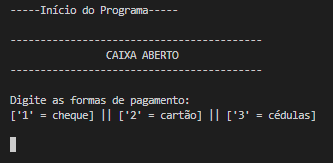
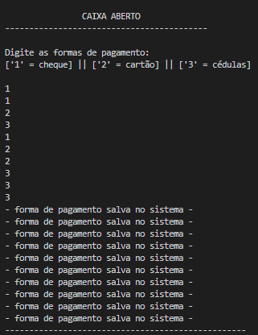
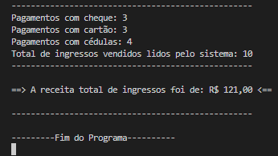

## Sistema para contabilizar ingressos pagos de uma balada 🎫 
- [x] pagamentos e formas de pagamentos 💵 💳
  

  

### Linguagem de Programação - C# 

Esse sistema foi desenvolvido com a finalidade é efetuar a leitura das formas de pagamentos dos ingressos de uma balada (dinheiro, cheque ou cartão) e ao final o sistema vai exibir o total de ingressos lidos pelo sistema, a quantidade de pessoas que pagou com dinheiro cheque ou cartão e a receita total de ingressos vendidos. Código proposto em uma atividade da faculdade.

- [x] Elaboração de um sistema para contabilizar os ingressos vendidos em um balada e exibir as características das diferentes formas de pagamentos. Para ficar dinâmico a funcionalidade, cada forma de pagamento entre as opções que o programa sugere possuí diferentes valores.
  
## Compilação 👨🏽‍💻

### Preview - Tela inicial código ▶

  

### Preview - Inserindo os dados no sistema 💻⬅

  

- [x] Para facilitar a representação foi inserido dados de 10 clientes:  
  
  |   Código   |  Pagamento  |  Valor |  Quantidade  |
  |------------|-------------|--------|--------------|
  |      1     |    Cheque   |  💲12   |      3       |
  |      2     |    Cartão   |  💲15   |       3      |
  |      3     |    Cédulas  |  💲10   |       4      |
 

## Preview - Fechamento do caixa 👨🏽‍💻

  

## Tecnologias 🛠

- DotNet
- C# 

## Autor 🎨

- <a target="_blank" href="https://www.linkedin.com/in/ramon-barreto-076191180/">Ramon Barreto</a>

## Contato 📲

- Email: ramon_barreto_medrado@hotmail.com

